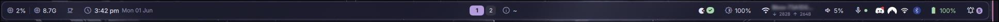
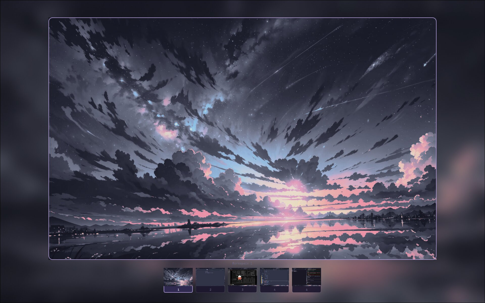
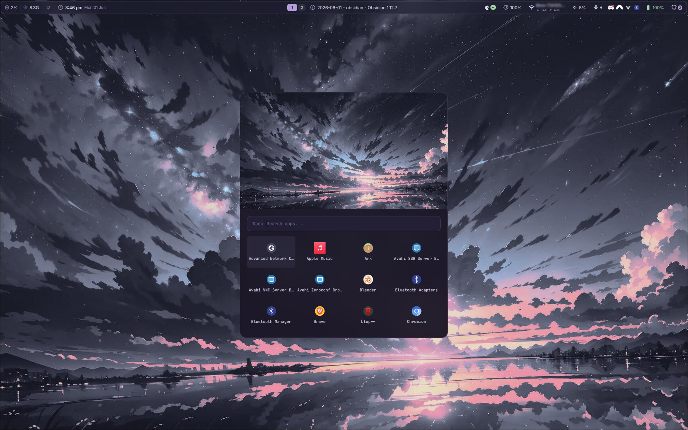
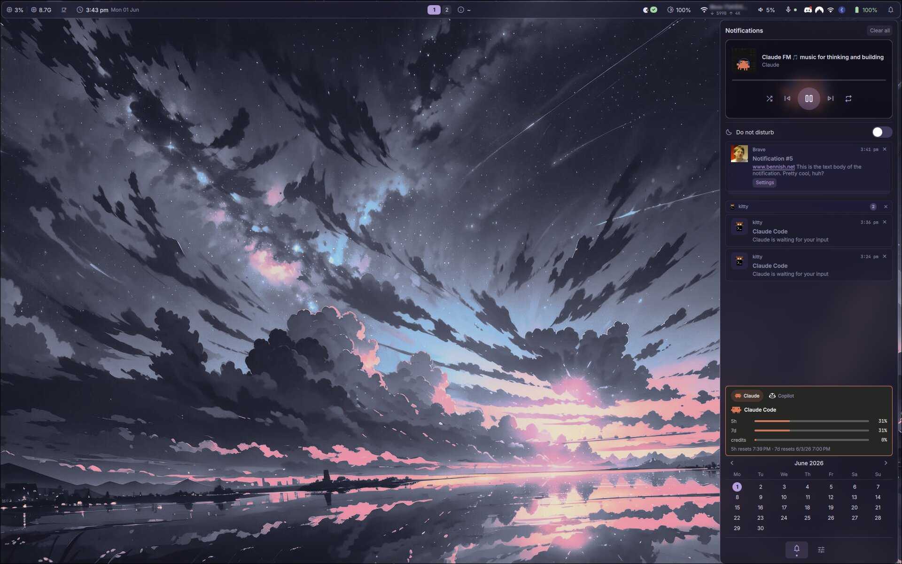
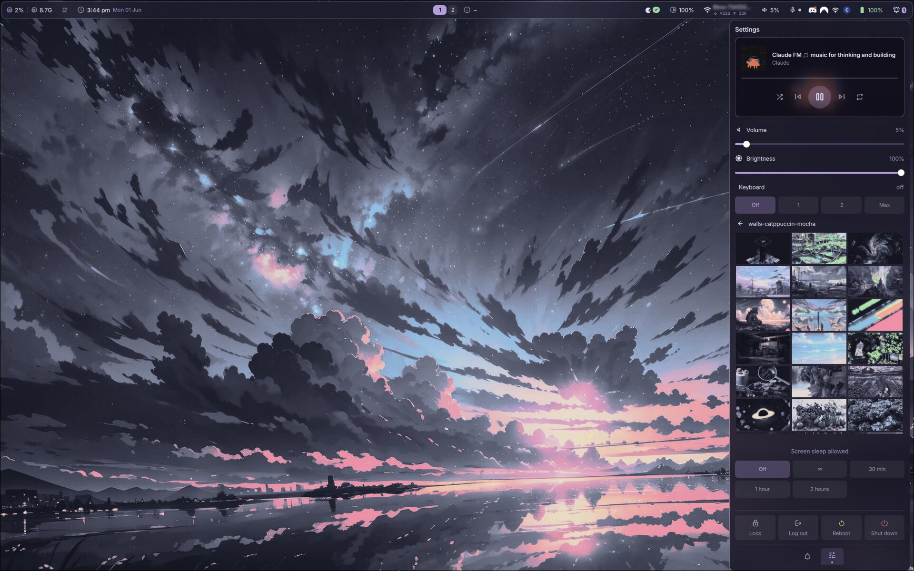

<div align="center">

# dotfiles

**Arch Linux · Hyprland · Catppuccin**

[](https://archlinux.org)
[](https://hyprland.org)
[](LICENSE)

</div>

---

<div align="center">
  
</div>

<div align="center">
  
  
</div>

<div align="center">
  
  
</div>

<div align="center">
  
</div>

<div align="center">
  <video src="assets/preview_video.mp4" autoplay loop muted playsinline width="100%"></video>
</div>

---

## About

A minimal, curated set of configuration files for an Arch Linux desktop built around Hyprland. Managed via a **bare git repository** — no symlink tools, no install framework, configs live at their real paths. Only the files that matter are tracked.

---

## Tech Stack

| Role | Tool |
|---|---|
| OS | [Arch Linux](https://archlinux.org) |
| Window Manager | [Hyprland](https://hyprland.org) (Lua config) |
| Shell | [Fish](https://fishshell.com) + [Starship](https://starship.rs) |
| Terminal | [Kitty](https://sw.kovidgoyal.net/kitty) |
| Bar & Launcher | [QuickShell](https://quickshell.outfoxxed.me) (QML / TypeScript) |
| Lock Screen | [Hyprlock](https://github.com/hyprwm/hyprlock) |
| Idle Daemon | [Hypridle](https://github.com/hyprwm/hypridle) |
| Editor | [VSCode](https://code.visualstudio.com) |
| Color Scheme | Catppuccin Mocha · Rosé Pine |
| Font | JetBrainsMono Nerd Font |

---

## Features

- **Lua-modular Hyprland config** — split across focused modules: `keybindings`, `windowrules`, `animations`, `autostart`, `monitors`, `input`, `options`
- **Custom QuickShell bar** — app launcher, file finder, emoji picker, icon picker, clipboard manager, notification center, media player, system stats, wallpaper picker, AI token usage widgets (Claude Code & GitHub Copilot)
- **Wallpaper sync script** — `set-wallpaper` applies a wave transition via `swww` and propagates the wallpaper to the lock screen and SDDM login manager in one command
- **Starship prompt** — right-aligned language indicators, per-project context, supports 50+ runtimes
- **Consistent theming** — Catppuccin Mocha / Rosé Pine colors applied uniformly across all tools

### Bar widgets

<details>
<summary><strong>Left — System Stats</strong></summary>

CPU % and RAM usage, polled every 2 s. Color-coded yellow/red at high load. Click opens `btop`.

</details>

<details>
<summary><strong>Left — Idle Clock</strong></summary>

Caffeine toggle (click to inhibit sleep indefinitely, shows countdown when timed) + clock with time and date.

</details>

<details>
<summary><strong>Center — Workspaces</strong></summary>

Per-monitor workspace pills. Active pill is wider and accent-colored. Click to switch workspace.

</details>

<details>
<summary><strong>Center — Active Window</strong></summary>

Focused window title on this monitor, truncated at 48 characters. Hidden when no window is active.

</details>

<details>
<summary><strong>Right — Updates</strong></summary>

Pending update count (pacman + AUR + Flatpak). Hover for per-source breakdown. Click to upgrade, right-click to re-check.

</details>

<details>
<summary><strong>Right — Brightness</strong></summary>

Screen backlight %. Scroll to adjust ±5 %, click to toggle 30 %/100 %.

</details>

<details>
<summary><strong>Right — Network</strong></summary>

Wi-Fi SSID, signal-strength icon, and live tx/rx speed. Non-interactive.

</details>

<details>
<summary><strong>Right — Volume</strong></summary>

Default sink volume and mute state. Scroll to adjust, click to toggle mute, right-click to open pavucontrol.

</details>

<details>
<summary><strong>Right — Microphone</strong></summary>

Default source mute indicator. Click to toggle mute, right-click to open pavucontrol.

</details>

<details>
<summary><strong>Right — Tray</strong></summary>

System tray icons. Left-click activates, right-click opens a themed popup menu with submenu support.

</details>

<details>
<summary><strong>Right — Battery</strong></summary>

Battery level and charging state from UPower. Color-coded green/yellow/red. Non-interactive.

</details>

<details>
<summary><strong>Right — Notifications button</strong></summary>

Bell icon with unread badge. Strikethrough when DND is on. Click toggles the notification center.

</details>

### Notification center (`Super + N`)

Slide-in panel from the right, two tabs (Notifications / Settings).

<details>
<summary><strong>Notifications tab — Media player</strong></summary>

MPRIS widget with album art, track info, progress bar, and playback controls (shuffle, previous, play/pause, next, repeat).

</details>

<details>
<summary><strong>Notifications tab — Do Not Disturb</strong></summary>

Toggle switch that silences toasts and changes the bar bell icon to a strikethrough variant.

</details>

<details>
<summary><strong>Notifications tab — Notification list</strong></summary>

Notifications grouped by app, each group collapsible with a per-app clear button. "Clear all" in the header. Auto-marked as read on open.

</details>

<details>
<summary><strong>Notifications tab — AI usage widget</strong></summary>

Usage bars for Claude Code (5h / 7d / credits) and GitHub Copilot (premium interactions). Refreshes on open and every 5 minutes while the panel is visible.

</details>

<details>
<summary><strong>Notifications tab — Calendar</strong></summary>

Month calendar view pinned at the bottom of the tab.

</details>

<details>
<summary><strong>Settings tab — Volume & Brightness</strong></summary>

Sliders for speaker volume (`wpctl`) and screen brightness (`brightnessctl`).

</details>

<details>
<summary><strong>Settings tab — Keyboard brightness</strong></summary>

Pill buttons to set keyboard backlight level: Off / 1 / 2 / Max.

</details>

<details>
<summary><strong>Settings tab — Wallpaper picker</strong></summary>

3-column thumbnail grid of `~/.local/share/wallpapers/` with folder navigation. Click a thumbnail to apply via `set-wallpaper`.

</details>

<details>
<summary><strong>Settings tab — Caffeine</strong></summary>

Sleep prevention with duration options: Off / ∞ / 30 min / 1 h / 2 h. Active pill shows remaining time.

</details>

<details>
<summary><strong>Settings tab — Power buttons</strong></summary>

Lock, Log out, Reboot, Shut down. Reboot and Shut down require confirmation.

</details>

### Launcher / pickers

Centered floating card with a wallpaper header. `Escape` or click outside to close.

<details>
<summary><strong>App launcher (<code>Alt + Space</code>)</strong></summary>

Searchable 4-column icon grid. Enter or click to launch.

</details>

<details>
<summary><strong>File finder (<code>Super + Shift + E</code>)</strong></summary>

Directory browser with path breadcrumb. Directories navigate in-place; files open with `xdg-open`.

</details>

<details>
<summary><strong>Emoji picker (<code>Super + ,</code>)</strong></summary>

Searchable emoji list. Selecting one copies it to the clipboard.

</details>

<details>
<summary><strong>Icon picker (<code>Super + .</code>)</strong></summary>

Searchable Nerd Font glyph list. Selecting one copies the character to the clipboard.

</details>

<details>
<summary><strong>Clipboard manager (<code>Super + V</code>)</strong></summary>

`cliphist` history with text previews and image thumbnails. Selecting an entry restores it to the clipboard.

</details>

<details>
<summary><strong>Window switcher</strong></summary>

Lists open windows with their class. Selecting one focuses it via Hyprland.

</details>

---

## Installation

> **Prerequisites:** `git`, `fish`

Clone the bare repository:

```bash
git clone --bare git@github.com:LeoBessin/dotfiles.git $HOME/.dotfiles
```

Check out the files into `$HOME`:

```bash
git --git-dir=$HOME/.dotfiles/ --work-tree=$HOME checkout
```

If there are conflicts with existing files, back them up first then rerun.

Hide untracked files from status output:

```bash
git --git-dir=$HOME/.dotfiles/ --work-tree=$HOME config --local status.showUntrackedFiles no
```

Add the alias to your Fish config (already included once you check out):

```fish
alias dotfiles='git --git-dir=$HOME/.dotfiles/ --work-tree=$HOME'
```

From then on, use `dotfiles` like regular `git` to stage, commit and push changes.

---

## Structure

```
~
├── .config/
│   ├── hypr/               # Hyprland WM — entry point + 7 Lua modules
│   │   ├── hyprland.lua
│   │   ├── lua/            # keybindings, windowrules, animations…
│   │   ├── hyprlock.conf
│   │   └── hypridle.conf
│   ├── fish/               # Shell startup & functions
│   ├── kitty/              # Terminal — Rosé Pine theme, JetBrainsMono
│   ├── quickshell/bar/     # Custom bar (QML + TypeScript)
│   └── starship/           # Prompt configuration
└── .local/
    └── bin/                # Scripts: set-wallpaper, ai-cli-picker…
```

---

## Keybindings

> `Super` = Windows key

| Shortcut | Action |
|---|---|
| `Super + T` | Terminal (Kitty) |
| `Super + B` | Browser (Brave) |
| `Super + C` | Editor (VSCode) |
| `Super + E` | File explorer (Dolphin) |
| `Super + Q` | Close focused window |
| `Super + W` | Toggle floating |
| `Super + L` | Lock screen |
| `Super + Tab` | Workspace switcher |
| `Alt + Space` | App launcher |
| `Super + Shift + E` | File finder |
| `Super + V` | Clipboard picker |
| `Super + ,` | Emoji picker |
| `Super + .` | Icon picker |
| `Super + N` | Notification center |
| `Super + Arrows` | Focus direction |
| `Shift + F11` | Toggle fullscreen |
| `Ctrl + Alt + Delete` | Logout menu |

---

## Wallpaper

Wallpapers are applied with **[awww](https://github.com/horus645/awww)**, a Wayland wallpaper daemon that supports animated transitions. The `set-wallpaper` script wraps it to keep everything in sync with a single command:

```sh
set-wallpaper /path/to/image.jpg
```

What it does under the hood:

1. Applies the wallpaper with a **wave transition** (`awww img --transition-type wave`)
2. Persists the chosen path to `~/.local/share/wallpapers/.current`
3. Copies the image to `/var/lib/sddm-wallpaper/current.jpg` so the **SDDM login screen** matches
4. Patches `hyprlock.conf` so the **lock screen** background updates immediately — no restart needed

The wallpaper picker in the QuickShell bar calls this script internally, so you can change wallpapers from the bar without touching the terminal.

---

## License

[MIT](LICENSE)
